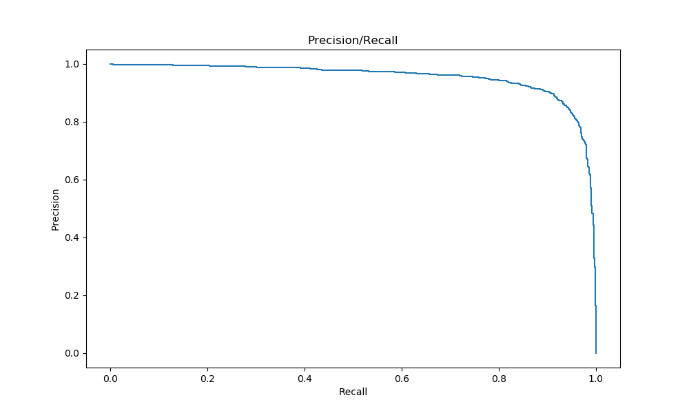
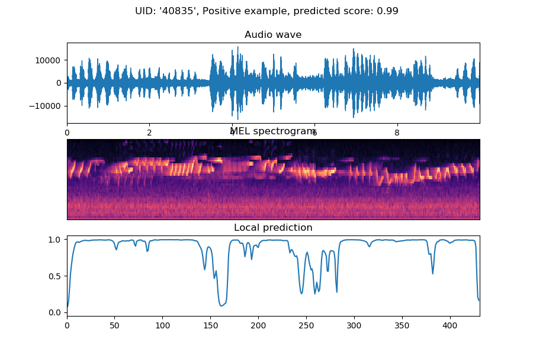
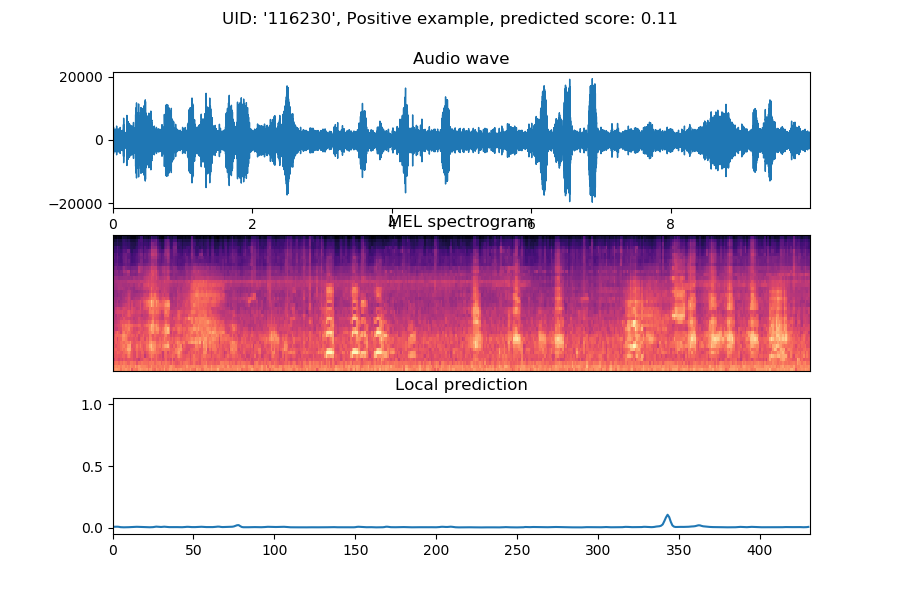
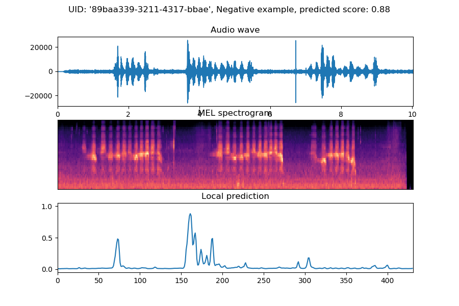
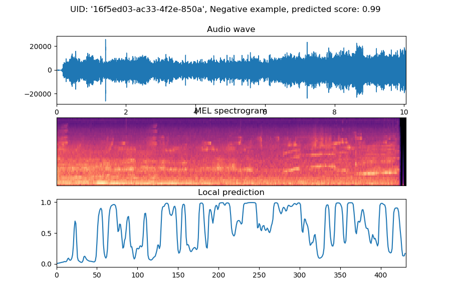

# Recural Neural Network model for temporal detection

This model has for objective to make a temporal detection of bird presence.

## Data

### Data type

The network is trained using weak annotations, consisting in short audio sequences of around 10s annotated with a global label marking the presence/absence of bird songs in each sequence.

The audio sequences are preprocessed in MEL spectrograms. So the inputs of the network are images with the dimensions *time*x*frequence*.

### Datasets

The datasets used are the training datasets from the challenge [DCASE 2018](http://dcase.community/challenge2018/task-bird-audio-detection-results). They consists of 3 separate sets:

* **Field recordings, worldwide ("freefield1010")** - a collection of 7,690 excerpts from field recordings around the world, gathered by the FreeSound project, and then standardised for research. This collection is very diverse in location and environment, and for the BAD Challenge we have annotated it for the presence/absence of birds.
* **Crowdsourced dataset, UK ("warblrb10k")** - 8,000 smartphone audio recordings from around the UK, crowdsourced by users of Warblr the bird recognition app. The audio covers a wide distribution of UK locations and environments, and includes weather noise, traffic noise, human speech and even human bird imitations.
* **Remote monitoring flight calls, USA ("BirdVox-DCASE-20k")** - 20,000 audio clips collected from remote monitoring units placed near Ithaca, NY, USA during the autumn of 2015, by the BirdVox project.

## Model

The model is the detection model described in [*Deep Learning for Audio Event Detection and
Tagging on Low-Resource Datasets*](https://www.researchgate.net/publication/327132108_Deep_Learning_for_Audio_Event_Detection_and_Tagging_on_Low-Resource_Datasets/fulltext/5b7b8bb792851c1e1223cdce/Deep-Learning-for-Audio-Event-Detection-and-Tagging-on-Low-Resource-Datasets.pdf) by Morfi and Stowell.

It can be decomposed in 4 blocks:

* a 2d-convolutional block that compute features on the spectrogram.
* a recursive block where the features at each time step are computed by using the features from neighboring time steps.
* a time-distributed dense block, where dense layers are applied independently on each time step features.
* A max-pooling final layer that combines the predictions at each time step to predict a global label for the sequence.

### Convolutional block

TODO

### Recursive block

TODO

### Time-distributed block

TODO

### Final pooling block

TODO

## Results

### Dataset splits

The first tests were run by combining the *freefield* and the *warblr* datasets and splitting them into training and validation sets.

### Performances

The model has a global accuracy of 90.18% and an AUC of 0.955. 

This suggests that the recall could be over 95% while keeping a precision of 83.5%.

### Examples
**CORRECT PREDICTIONS**

**FALSE PREDICTIONS**

**LABELLING ERRORS**

There seems to be some errors in the annotations:

