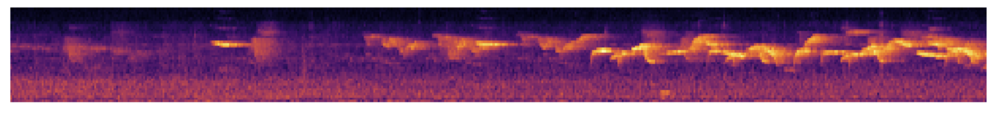

# Background

Biodiversity evaluation and monitoring is the first step toward its protection. The goal of the Microfaune project is to evaluate avifauna in Cité Universitaire park (Paris, France) from audio recordings.


The aim is to provide the scientific community with a labeled database (bird/no-bird) and to develop machine learning algorithms for bird audio detection. The project includes also the creation (from scratch or using existing tools) of web-based tools to label and visualize bird sounds.

The goal is to advance leverage state of the art research and contribute to open data in the field.

# Roadmap

Here is a tentative roadmap (to be challenged!):


# Getting Started

## Audio Tutorial



Since we'll work on audio data, it should be useful to have notions on basic operations on audio. We provide an introductory notebook showing how to load audio data, listen to it in the notebook, plot waveforms, calculate spectrograms, etc.

Here is a [notebook](https://github.com/hadrienj/microfaune/blob/master/getting_started.ipynb) to get started! Feel free to contribute and improve this notebook!

## Collaboration

- Google Doc: Details on the projects are gathered [here](https://docs.google.com/document/d/1yREuA9-AuH0du2uhvGiSryd0PYd7ogVkyXDWf-VLQxw/edit?usp=sharing).
- Trello: This is [here](https://trello.com/b/amUmPAtu/microfaune).

## Setup

Using pipenv to create virtual environment. You need to have `pipenv` installed:

On mac:

```
brew install pipenv
```

Other plateforms: see the [doc](https://docs.pipenv.org/en/latest/install/#installing-pipenv).

Then, you can fork or clone this repo and run:

```
pipenv install
```

And you should have all dependencies installed! (Locking can take some time so be patient!).

To install a lib you need, e.g:

```
pipenv install numpy
```

To run Python from the virtual environment:

```
pipenv run ...
```

For instance, to run a Jupyter notebook:

```
pipenv run jupyter notebook
```

# External Data

If you look on the roadmap, you should see some sub-projects using external data. These data are audio files labelised with the presence or absence of bird. There are at least two databases:

- Warblr
- FreeField1010

Some ideas can be tried on these data making easy comparison of performances.

You can find these databases [here](http://machine-listening.eecs.qmul.ac.uk/bird-audio-detection-challenge/).

# Wazo Data

Wazo Data are data from recordings in Cité Universitaire in Paris. Data should be accessible soon.


