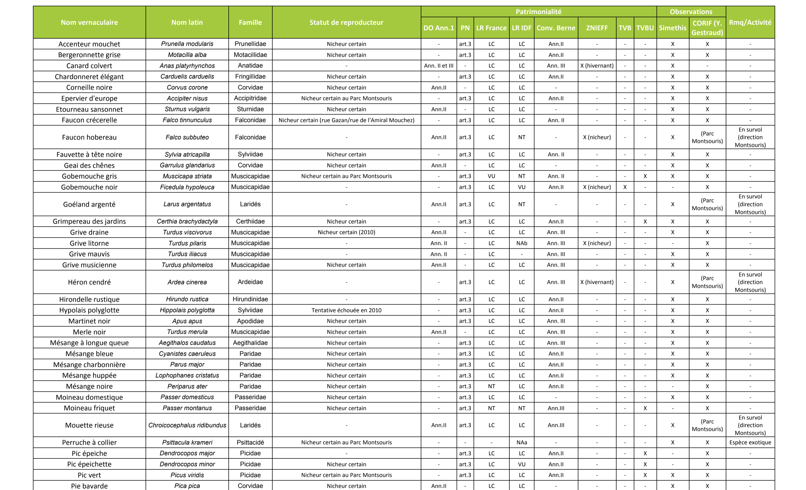

# Background

Biodiversity evaluation and monitoring is the first step toward its protection. The goal of the Microfaune project is to evaluate avifauna in Cité Internationale park (Paris, France) from audio recordings.


The aim is to provide the scientific community with a labeled database (bird/no-bird) and to develop machine learning algorithms for bird audio detection. The project includes also the creation (from scratch or using existing tools) of web-based tools to label and visualize bird sounds.

The goal is to leverage state of the art research and contribute to open data in the field.


# Getting Started

## Audio Tutorial


Since we are working on audio data, you can get notions about basic operations on audio using this [introductory notebook](https://github.com/hadrienj/microfaune/blob/master/getting_started.ipynb) that shows how to load audio data, listen to it in the notebook, plot waveforms, calculate spectrograms, etc. Feel free to contribute and improve this notebook!


# The Microfaune package

You can find the documentation of the Microfaune package [here](https://microfaune.github.io/microfaune/).

The package contains methods to handle audio and do prediction bird/no bird.

## How to use the model to do predictions

Let's start to create an instance of the bird detector:

```python
from microfaune.detection import RNNDetector

detector = RNNDetector("path_to_h5_weights")
```

The parameter in `RNNDetector` is the path to model weights if it exists. If you leave it empty `RNNDetector()`, the pre-trained model will be used.

Then, you can use the model to predict the presence of bird in wav files:

```python
global_score, local_score = detector.predict_on_wav("path_to_wav_file")
```

## How to train a model with your data

You can have a look at [this notebook](https://github.com/microfaune/microfaune/blob/master/modeling/rnn_model/learn_model.ipynb) that shows how to train the model with some data.


# Detection model: Recural Neural Network model for temporal detection

This model has for objective to make a temporal detection of bird presence.

## Data

### Data type

The network is trained using weak annotations, consisting in short audio sequences of around 10s annotated with a global label marking the presence/absence of bird songs in each sequence.

The audio sequences are preprocessed in MEL spectrograms. So the inputs of the network are images with the dimensions *time*x*frequence*.

### Datasets

The datasets used are the training datasets from the challenge [DCASE 2018](http://dcase.community/challenge2018/task-bird-audio-detection-results). They consists of 3 separate sets:

* **Field recordings, worldwide ("freefield1010")** - a collection of 7,690 excerpts from field recordings around the world, gathered by the FreeSound project, and then standardised for research. This collection is very diverse in location and environment, and for the BAD Challenge we have annotated it for the presence/absence of birds.
* **Crowdsourced dataset, UK ("warblrb10k")** - 8,000 smartphone audio recordings from around the UK, crowdsourced by users of Warblr the bird recognition app. The audio covers a wide distribution of UK locations and environments, and includes weather noise, traffic noise, human speech and even human bird imitations.
* **Remote monitoring flight calls, USA ("BirdVox-DCASE-20k")** - 20,000 audio clips collected from remote monitoring units placed near Ithaca, NY, USA during the autumn of 2015, by the BirdVox project.


## Model

The model is the detection model described in [*Deep Learning for Audio Event Detection and
Tagging on Low-Resource Datasets*](https://www.researchgate.net/publication/327132108_Deep_Learning_for_Audio_Event_Detection_and_Tagging_on_Low-Resource_Datasets/fulltext/5b7b8bb792851c1e1223cdce/Deep-Learning-for-Audio-Event-Detection-and-Tagging-on-Low-Resource-Datasets.pdf) by Morfi and Stowell.

It can be decomposed in 4 blocks:

* a 2d-convolutional block that compute features on the spectrogram.
* a recursive block where the features at each time step are computed by using the features from neighboring time steps.
* a time-distributed dense block, where dense layers are applied independently on each time step features.
* A max-pooling final layer that combines the predictions at each time step to predict a global label for the sequence.


## Results

### Dataset splits

The first tests were run by combining the *freefield* and the *warblr* datasets and splitting them into training and validation sets.

### Performances

The model has a global accuracy of 90.18% and an AUC of 0.955.


This suggests that the recall could be over 95% while keeping a precision of 83.5%.

### Examples
**CORRECT PREDICTIONS**


**FALSE PREDICTIONS**


**LABELLING ERRORS**

There seems to be some errors in the annotations:


# External Data

Detection DB:

- Warblr
- FreeField1010

You can find both of these databases [here](http://machine-listening.eecs.qmul.ac.uk/bird-audio-detection-challenge/).


# Avifauna at Cité Internationale

Here is the data from the scientific survey from 2014:




