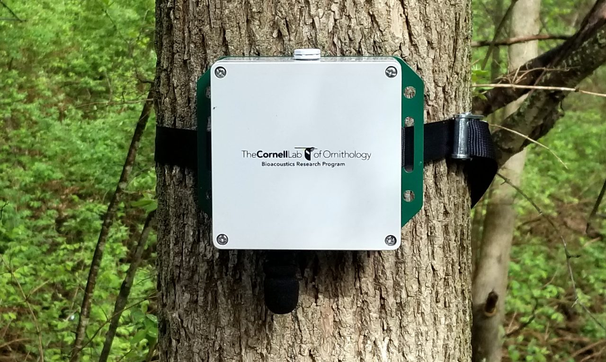
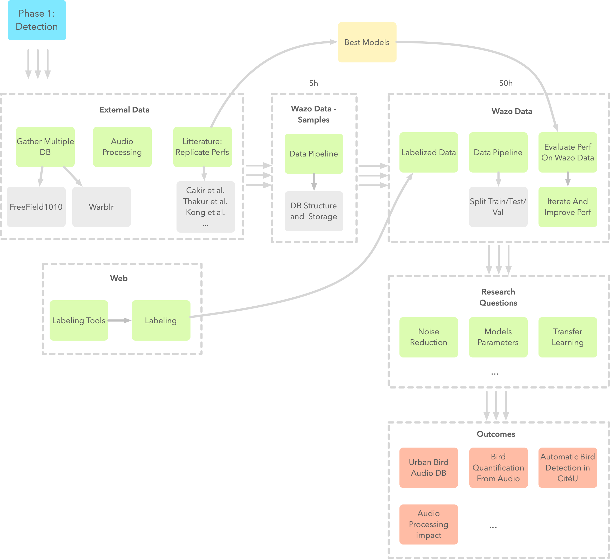

# Background

Biodiversity evaluation and monitoring is the first step toward its protection. The goal of the Microfaune project is to evaluate avifauna in Cité Universitaire park (Paris, France) from audio recordings.

The aim is to provide the scientific community with a labeled database (bird/no-bird) and to develop machine learning algorithms for bird audio detection. The project includes also the creation (from scratch or using existing tools) of web-based tools to label and visualize bird sounds.

The goal is to advance leverage state of the art research and contribute to open data in the field.

# Skills

You have or want to acquire any of these skills:

- Machine Learning
- Deep Learning (CNN, RNN...)
- Web Development
- Transfer Learning
- Signal Processing
- Data Engineering
- Audio processing
- Ecological interest
...

# Roadmap

Here is a tentative roadmap (to be challenged!):

# Introduction

## Audio Tutorial

Since we'll work on audio data, it should be useful to have notions on basic operations on audio. We provide an introductory notebook showing how to load audio data, listen to it in the notebook, plot waveforms, calculate spectrograms, etc. Feel free to contribute and improve this notebook if you see anything that you think is missing.

## Knowledge Sharing

Let's try to define setup we'll need and try to have a homogeneous workspace to make collaboration easy (and remote work possible). Here's my take (to be challenged as well :) ):

- Using pipenv to create virtual environments
- Using Jupyter notebook (local and through Google Colab)
- Understand audio data and possibilities (cf. Audio Tutorial)
